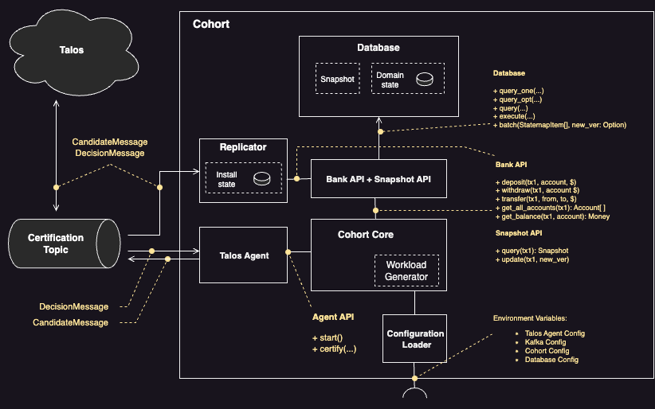

[](https://crates.io/crates/talos_certifier)
[](https://github.com/kindredgroup/talos/actions/workflows/master.yml)
[](https://app.codecov.io/gh/kindredgroup/talos)


# Talos


[comment]: <> (TOC_START)

-   [Overview](#overview)
-   [Getting Started](#getting-started)
    -   [Requirements](#getting-started-requirements)
    -   [Installation and setup.](#getting-started-installation-and-setup)
    -   [Rust Scripts](#getting-started-rust-scripts)
    -   [Committing Code](#getting-started-committing-code)
-   [IDE's](#ides)
    -   [VSCODE Settings](#ides-vscode-settings)
-   [Usage](#usage)
-   [Release Notes](#release-notes)

[comment]: <> (TOC_END)

## Overview <a name="overview"></a>

Talos is based on the STRIDE algorithm for strict serializable certification of distributed transactions

## Getting Started <a name="getting-started"></a>

### Requirements <a name="getting-started-requirements"></a>

-   [docker (20.10.6)](https://docs.docker.com/get-docker/)
-   [cargo (1.68.0), rust (1.68.0)](https://www.rust-lang.org/tools/install) only required if wanting to run outside of docker
-   openssl for SASL supports

### Installation and setup. <a name="getting-started-installation-and-setup"></a>

**OSX**
First install homebrew [https://brew.sh/](https://brew.sh/).
Install coreutils package.

```bash
brew install coreutils
brew install openssl
```

To setup local development run the following.

```bash
make withenv RECIPE=dev.init
```

### Rust Scripts <a name="getting-started-rust-scripts"></a>

To compile code:

```bash
make withenv RECIPE=build
```

To run the unit tests:

```bash
make withenv RECIPE=test
```

To run the unit tests with code coverage:

```bash
make withenv RECIPE=test.unit.coverage.rust
```

To check and fix the linting of your code there are the following commands (it's a good idea to do this before attempting your commit)

```bash
make withenv RECIPE=lint
```

### Committing Code <a name="getting-started-committing-code"></a>

This repo enforces [conventional commits](https://www.conventionalcommits.org/en/v1.0.0/).
Once you have checked, tested and linted your code you may create a commit.

## IDE's <a name="ides"></a>

### VSCODE Settings <a name="ides-vscode-settings"></a>

```json
{
    "editor.formatOnSave": false,
    "editor.trimAutoWhitespace": true,
    "files.trimTrailingWhitespace": true
}
```

## Usage <a name="usage"></a>

### Cohort Reference Implementation


## Release Notes <a name="release-notes"></a>
