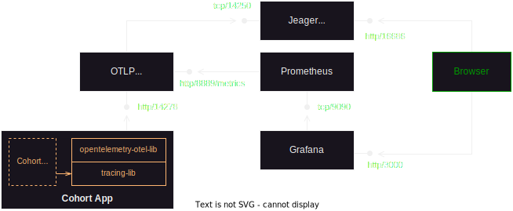
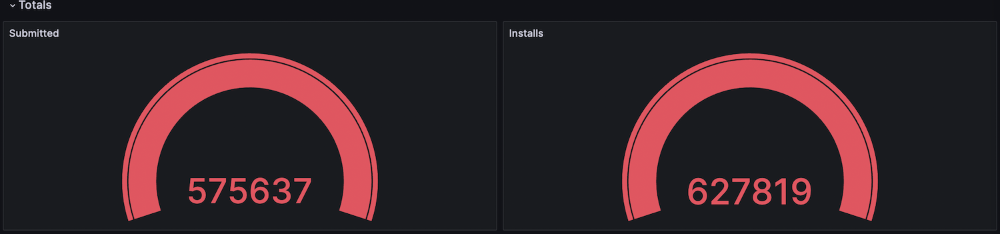
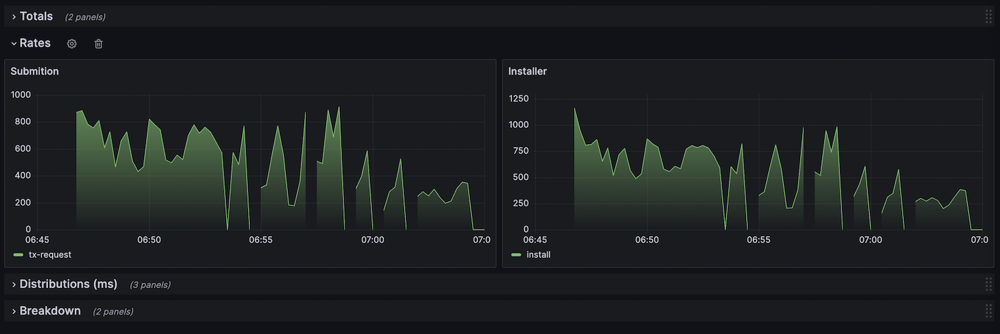
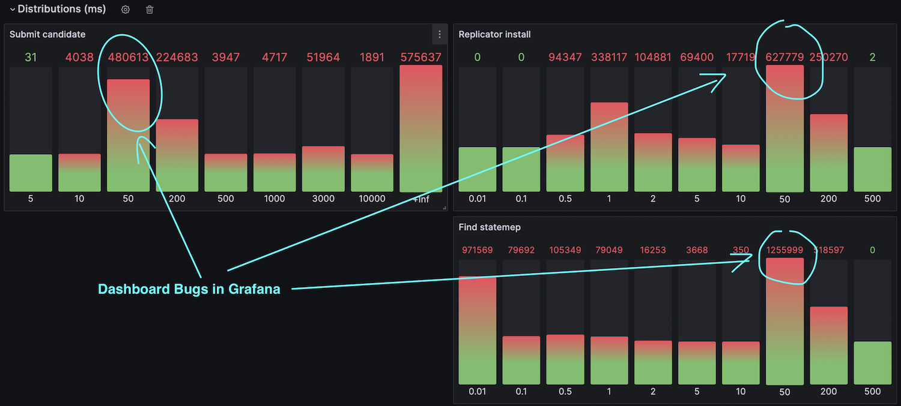
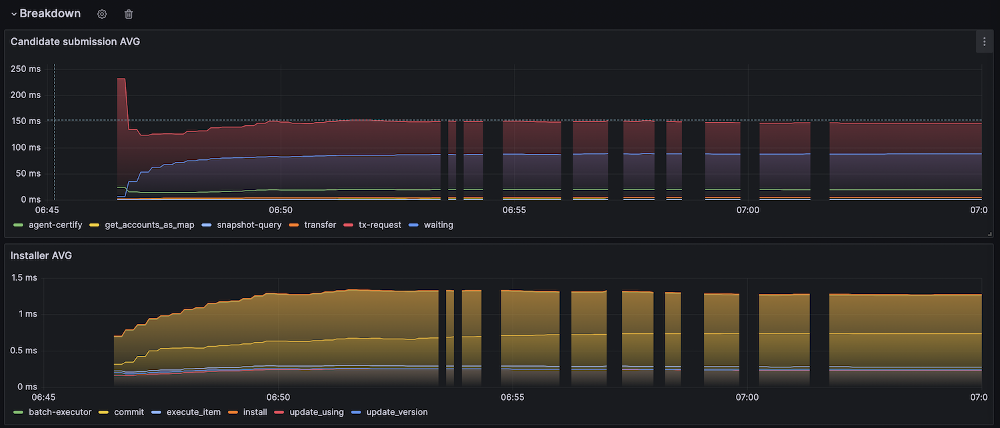

# Monitoring and Observability R&D

## About this directory

The purpose of this directory is to collect all artefacts we used for R&D as well as to provide documentation and examples in case we need to resume the work.

## Quick summary

We instrumented our code using tracing libs and exported traces with metrics into Jeager + Prometheus. We charted some of them with Grafana.

### Key outcomes

- Lots of configuration and runnable components are required
- System performance goes down by 50%
- Some open questions left:
    - How to use this solution to plot business metrics? For example, the sizes of internal channels/queues, message roundtrips and etc.
    - How to visualise stacked timeline where all sub spans are placed on top of each other?
    - How to propagate span context a) between threads; b) between Cohort and Talos?

## The state before R&D

The following packages are instrumented using custom code:
    - `packages/cohort`
    - `packages/talos_agent`
    - `packages/talos_certifier`

We created a simple internal SDK for metrics collection. We use it around critical code sections to measure the performance. We recorded observed values in a few places - 1) into in memory storage, 2) as metadata attributes in kafka messages, 3) along with Talos decision message into Talos XDB database.

During program execution we periodically collate and print some metrics into log.

In the end of execution, we print two summary reports:
    - from cohort package
    - from talos_agent package

After program execution we extract metrics by parsing log files, or re-consuming kafka messages with metrcis, or query talos XDB. Once extracted we plot metrics using Excel charts.

See **Appendix A** for more details.

## The reason for R&D

We had no explicit purpose of creating internal metrics SDK and tooling. The final solution grew naturally in small increments basically on demand as we need to expose some data for performance analysis while debugging the app. As a result, code is not production ready and rather than spending effort polishing it we invested some time into research to see what similar tools are available from the open source.

## The purpose of R&D

Explore what it takes to re-factor our custom metrics code (curretly used in `packages/cohort`, `packages/talos_agent`, `packages/talos_certifier`) by replacing it with dedicated free/open source tools and libraries. More specifically - to find code instrumentation library capable of producing various metrics to help us in identifying performance problems. Below is the list of high-level requirements were used as a guidance.

1. It should be possible to break down the processing of certification transaction into logical segments, for example, into "spans" and measure the duration of each span separately.
1. Capture these measurements in such a way that it is possible to compute common percentiles as well as common aggregates - min, max, avg, rates, counts.
1. Visualise the duration of these spans so that we could identify what segments are taking too long to execute.
1. Account for two environments:
    - local development on Mac (the current)
    - on the Kindred servers such as PT, sbx, prod and etc.

For example, given that we measured the longest duration candidate which came up as 3 seconds we want to know the following latencies:
- the preparation of candidate request
- the posting of request to kafka
- the time message spent in kafka before it was consumed by Talos
- the decision making by Talos
- the suffix maintenance by Talos
- the DB access times by Talos
- the decision trip back to Talos Agent
- the installation of statemap into Cohort DB


## Solution Stack used in R&D

| Category              | Solution |
| ----------------------| --------- |
| Code instrumentation  | [Rust Tracing](https://docs.rs/tracing/latest/tracing) |
| Metrics collection    | [Rust OTLP](https://crates.io/crates/opentelemetry-otlp)
| Metrics collection    | [Otel Collector](https://opentelemetry.io/docs/collector)|
| Time series backend   | [Prometheus 2.45.0](https://prometheus.io/download/)|
| Tracing backend       | [Jeager 1.47.0 (all in one)](https://www.jaegertracing.io/download/#binaries)|
| Tracing UI            | Jeager UI (included in the above backend)|
| Metrcis UI            | [Grafana 10](https://grafana.com/grafana/download/10.0.0?edition=oss&pg=oss-graf&plcmt=hero-btn-1&platform=mac)|


### Architecture



## Summary

### Custom solution

**Advantages**

- Full control of what is collected and printed
- Excel provides easy UI for charting anything
- No noticeable cost in performance
- Convenience of having a summary report printed as text
- No special software is needed for metrics collection

**Disadvantages**

 - We can only analyse data we collected
 - Manual efforts in transferring data to Excel
 - Separate Excel file per test run
 - External libs are not analysed
 - A lot of extra code to maintain, efforts required in unit testing
 - Tracing timelines by method calls require instrumentation effort

### R&D stack

**Advantages**

- Dedicated off the shelf products
- Mostly well documented, well known in the industry
- Metrics model is standard (to some extent)
- Opentelemetry integrates well with major players in the industry
- Tracing using annotations like `#[instrument]` is easy
- Opens the possibility to peek into external libraries when their log records are converted into events and automatically attached to the current span.

**Disadvantages**

- Slow. System performance drops by 50% when this stack is used on local machine
- Requires lots of processes to run. Packaging them up into Docker slows M1 machine to the point where restart is required.
- The lack of business metrics. For example, producing custom metrics require instrumentation code as well as exporting code.
- It seems that OTEL controller is not that flexible. Not possible to customise what is being fed to Prometheus. It aggregates spans into four metrics: "calls", "xyz_sum", "xyz_count", "xyz_buckets" (here xyz in the numeric metric, in our case the span duration was automatically picked up as "duration" value in nanos.) Events attached to spans are ignored.

# Appendix A - Examples of custom metrics solution

## Report printed by Talos Agent library

```
Publishing: 1370.84 tps
Throughput:  1370.70 tps

'Rroundtrip (mcs)' ['client until agent 1 (mcs)', 'enqueued for in-flight tracing 2 (mcs)', 'publishing task spawn 3 (mcs)', 'kafka publishing 4 (mcs)', 'C. kafka trip 5 (mcs)','decision duration 6 (mcs)', 'D. kafka trip 7 (mcs)', 'agent to client 8 (mcs)']
Max (mcs):  1055923: [      14,        0,       11,   981981,    15283,     9381,    49194,       56]
Min (mcs):      899: [       6,        0,        3,       51,      223,       23,      587,        5]
99% (mcs):    70336: [      98,        5,       49,     6204,     3536,    57726,    10187,      219]
95% (mcs):    47307: [      27,        1,       22,     5778,     1452,    34747,     8490,      133]
90% (mcs):    19275: [      15,        1,       14,     5697,     1025,     4868,     8176,      102]
75% (mcs):    14100: [       8,        1,        5,     5474,      729,      528,     7706,       66]
50% (mcs):    12916: [       6,        0,        2,     4890,      540,      321,     7140,       41]

Min,Max,p75,p90,p95,Errors
899,1055923,14100,19275,47307,0
```

## Report printed by Cohort Banking example

```
------------------------------------------
Set size    : 6322 - candidates per thread
Threads     : 100
Total time  : 461.279 (sec)
Transactions: 632273
Retries     : 32273
  min, max  : 0, 5
Given up    : 0 - used up all retry attempts (10)

Throughput (tps)
  Client view     : 1370.697 - observed by end user, this excludes retries
  System          : 1440.661 - produced by system, this includes retries
  System projected: 1605.720 - produced by system excluding time spent sleeping

Durations
  Tx min    : 0.001 (sec)
  Tx max    : 1.079 (sec) - candidate roundtrip

     p50    : 0.018 (sec)
     p75    : 0.022 (sec)
     p90    : 0.057 (sec)
     p95    : 0.090 (sec)
     p99    : 1.021 (sec)

  Sleeps    : 0.147 (sec avg. per retry) - time wasted on sleeps before retrying
  Waited    : 279.918 (sec avg. per thread) - initiator waited for safepoint
            : 0.000 (sec min)
            : 1.013 (sec max)

Errors
  Talos aborts: 32255
  Validations : 0
  DB isolation: 18 - DB rollbacks caused by tx isolation conflicts
  Exceptions  : 0
  Threading   : 0 - Tokio threading errors
------------------------------------------
```

## Charting

See the detailed example file [custom-cohort-metrics.xlsx](custom-cohort-metrics.xlsx)

Commands used to extract custom metrics from log files see [scripts/extract-custom-metrics.sh](scripts/extract-custom-metrics.sh)

# Appendix B - R&D stack

## Configurations

| Item | Details |
| ---- | ------- |
| Jeager UI config | [configs/jaeger-config.json](configs/jaeger-config.json) |
| OTEL Collector config | [configs/otel-collector-config.yml](configs/otel-collector-config.yml) |
| Prometheus config | [configs/prometheus.yml](configs/prometheus.yml) |
| Grafana config | [configs/grafana.ini](configs/grafana.ini) |
| Grafana linking with Prometheus | [configs/grafana_provisioning/datasources/datasource.yml](configs/grafana_provisioning/datasources/datasource.yml) |
| Grafana dashboard | [configs/grafana_provisioning/dashboards/cohort-dashboard.json](configs/grafana_provisioning/dashboards/cohort-dashboard.json) |
| Prometheus start | [scripts/prometheus-start.sh](scripts/prometheus-start.sh) |
| Grafana start | [scripts/grafana-start.sh](scripts/grafana-start.sh) |
| Jeager and OTEL Collector start | [scripts/jeager-otel-start.sh](scripts/jeager-otel-start.sh) |

## Grafana Dashboard Example





